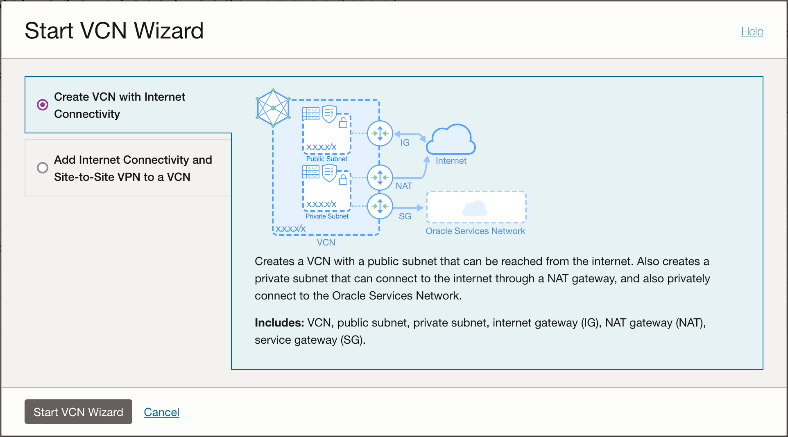

# Securing OCI Functions

# Introduction

In today's digital landscape, where agility and scalability are paramount, microservices architecture has emerged as a transformative approach for building and deploying applications. By breaking down monolithic applications into smaller, independent services, organizations can accelerate development cycles, improve scalability, and enhance overall agility.

However, with the adoption of microservices comes the need for robust security measures to safeguard sensitive data and mitigate potential risks. As microservices communicate over networks and interact with various components, securing these distributed systems becomes increasingly complex. Addressing security concerns such as authentication, authorization, data encryption, and protection against common threats is crucial to ensuring the integrity and confidentiality of microservices-based applications.

In this webinar, we will explore how Oracle Cloud Infrastructure (OCI) Functions, Oracle's serverless computing platform, provides a powerful and efficient solution for securing microservices deployments. OCI Functions empowers developers to focus on writing code without worrying about infrastructure management, offering a scalable and cost-effective environment for running serverless functions. By leveraging OCI Functions, organizations can enhance the security posture of their microservices architecture while optimizing resource utilization and minimizing operational overhead.

Throughout this session, we will delve into microservices security and demonstrate practical strategies for securing microservices with OCI Functions and API Gateway.

# Deploying and securing a microservice on OCI

[Oracle Cloud Infrastructure Functions](https://docs.oracle.com/en-us/iaas/Content/Functions/home.htm#top "Functions is a serverless platform that enables you to create, run, and scale business logic without managing any infrastructure.") is a fully managed, multi-tenant, highly scalable, on-demand, Functions-as-a-Service platform. 

It is built on enterprise-grade Oracle Cloud Infrastructure and powered by the Fn Project open source engine. Use OCI Functions (sometimes abbreviated to just Functions, and formerly known as Oracle Functions) when you want to focus on writing code to meet business needs. 

The serverless and elastic architecture of OCI Functions means there's no infrastructure administration or software administration for you to perform. 

You don't provision or maintain compute instances, and operating system software patches and upgrades are applied automatically. 

OCI Functions simply ensures your app is highly-available, scalable, secure, and monitored. 

With OCI Functions, you can write code in Java, Python, Node, Go, Ruby, and C# (and for advanced use cases, bring your own Dockerfile, and Graal VM). You can then deploy your code, call it directly or trigger it in response to events, and get billed only for the resources consumed during the execution.

In the following guide, we will take a look at how we can set up a microservice running on OCI Functions and securing it.

## Prepare the development environment 💻

Let's quickly spin up a Compute instance that we'll use as a development environment for this exercise. We will be remotely connecting to this instance from VS Code, with the help of the Remote - SSH extension.

### Creating an Always Free compute instance 🆓

Next step in our exercise is to create an Always Free instance on Compute where we can build and run our GCN application. 

#### Creating a VCN

1. Open the navigation menu, click **Networking**, and then click **Virtual cloud networks**.
2. Under **List Scope**, select a compartment that you have permission to work in.
3. Click **Start VCN WIzard**, and select **Create VCN with Internet Connectivity**.
4. Enter a name (`vcn-gcn-demo`) and a CIDR Block (ex. `172.16.0.0/24`).



5. Add the CIDR Blocks for the two subnets:
   - **Public**: `172.16.0.0/26`
   - **Private**: `172.16.0.64/26`


5. Click on **Next**, and then **Create**.

Once the creation is complete, click on View VCN to see the newly created resources.


6. Navigate to the Security List and add ports tcp/80 and tcp/443 to the allowed ports.


#### Creating the compute instance

And now finally we can create our Compute instance. For that, we will open the menu in the OCI console, navigate to **Compute** - **Instances** and then click on **Create Instance**.

Give the instance a name, for example `gcn-demo`, then select the image and shape corresponding to Ampere A1 / aarch64. If needed, increase the number of core OCPUs and the memory (ex. 2 OCPUs, 16GB memory).


Make sure our newly created VCN and the public subnet are selected in the list.


Download the generated SSH keys or add your own to the instance. 


And then click on **Create** at the bottom. Your instance will soon be provisioned and we can use it to work on our application.

#### Set up the OCI compute instance

Create a new dynamic group to include the compute instance:

1. Open the navigation menu and click **Identity & Security**. Under **Identity**, click **Dynamic Groups**.
2. Create a new dynamic group.
3. Enter a rule that includes the compute instance's OCID:

 ```
ANY {instance.id = '<instance-ocid>'}
```

4. Create policy for dynamic group 

Create a policy to give the new dynamic group access to function resources, network resources, and Oracle Cloud Infrastructure Registry:

Open the navigation menu and click **Identity & Security**. Under **Identity**, click **Policies**.

Click **Create Policy** and use the Policy Builder's manual editor to create a new policy with the following policy statements:

```
Allow dynamic-group <dynamic-group-name> to manage functions-family in compartment <compartment-name>
Allow dynamic-group <dynamic-group-name> to use virtual-network-family in compartment <compartment-name>
Allow dynamic-group <dynamic-group-name> to read repos in tenancy
```


#### Connecting from Visual Studio Code 🧑‍💻

In VS Code, navigate to Remote SSH, and open up the command palette. Select Open SSH Configuration File from the list so we can add our connection in.


In our `.ssh/config` file, we need to add our details in as it follows:

```
Host gcn-demo
	HostName [PUBLIC IP]
	User opc
	IdentityFile /path/to/ssh/private.key
```

Save the file and close it, then refresh the Remotes list. Our newly added connection should appear right at the top. Click on **Connect in current window**.


Next, let's install Podman and the Fn CLI.

```bash
sudo dnf install -y podman

curl -LSs https://raw.githubusercontent.com/fnproject/cli/master/install | sh
```

> [OPTIONAL] If the compute instance is running on ARM architecture, use the script below for building and installing it:

```bash
#!/bin/bash

# Clone the fn CLI repository
git clone https://github.com/fnproject/cli.git
cd cli

# Install Go (if not already installed)
sudo dnf -y install go

# Set up Go environment variables
export GOPATH=$HOME/go
export PATH=$GOPATH/bin:$PATH

# Build the fn CLI for aarch64
GOARCH=arm64 go build -o fn

# Move fn binary to /usr/local/bin if build successful
if [ -f fn ]; then
    sudo mv fn /usr/local/bin/fn
    echo "fn binary moved to /usr/local/bin/fn"
else
    echo "Failed to build fn binary. Exiting."
    exit 1
fi

# Verify the compiled fn CLI binary
file /usr/local/bin/fn

# Run the fn CLI version command
/usr/local/bin/fn --version

# Delete the cli folder
cd ..
rm -rf cli
```

**Then make it executable and run it**:

```bash
chmod +x fn-install-aarch64.sh
./fn-install-aarch64.sh 
```

**Example output:**

```bash
Cloning into 'cli'...
remote: Enumerating objects: 13813, done.
remote: Counting objects: 100% (3624/3624), done.
remote: Compressing objects: 100% (1131/1131), done.
remote: Total 13813 (delta 2528), reused 3362 (delta 2391), pack-reused 10189
Receiving objects: 100% (13813/13813), 16.96 MiB | 29.14 MiB/s, done.
Resolving deltas: 100% (7216/7216), done.
Last metadata expiration check: 1:49:33 ago on Sun 18 Feb 2024 10:14:32 AM GMT.
Package golang-1.20.10-1.module+el8.9.0+90068+08775a1f.aarch64 is already installed.
Dependencies resolved.
Nothing to do.
Complete!
fn binary moved to /usr/local/bin/fn
/usr/local/bin/fn: ELF 64-bit LSB executable, ARM aarch64, version 1 (SYSV), dynamically linked, interpreter /lib/ld-linux-aarch64.so.1, for GNU/Linux 3.7.0, BuildID[sha1]=1ba8ac0f5f950749359763ad0041960abfa7a062, with debug_info, not stripped
fn version 0.6.29
```

## Configure OCI Functions 🌤️

In the OCI Console, let's navigate to **Developer Services** and click on **Functions**. Select Create application to create the app in which we'll run our microservice.

Make sure you have selected the VCN we created in the previous step, and pick the Shape corresponding to the compute image shape.


### Get the Auth token for OCIR

Before you can push and pull Docker images to and from Oracle Cloud Infrastructure Registry (also known as Container Registry), you must already have an Oracle Cloud Infrastructure username and an auth token. If you haven't got an auth token, or you've forgotten it, or you're not sure, you can create a new auth token. You only see the auth token string when you create it, so be sure to copy the auth token to a secure location immediately.

> Each user can have up to two auth tokens at a time. So if you do lose or forget the auth token, you can always create a second auth token.

To create a new auth token:

1. In the top-right corner of the Console, open the **Profile** menu and then click **User Settings** to view the details.
2. On the **Auth Tokens** page, click **Generate Token**.
3. Enter a friendly description for the auth token. Avoid entering confidential information.
4. Click **Generate Token**. The new auth token is displayed.
5. Copy the auth token immediately to a secure location from where you can retrieve it later, because you won't see the auth token again in the Console.
6. Close the Generate Token dialog.

### Create or Update your Dynamic Group

In order to use other OCI Services, your function must be part of a dynamic group. 
When specifying the **Matching Rules**, we suggest matching all functions in a compartment with:

```
ALL {resource.type = 'fnfunc', resource.compartment.id = 'ocid1.compartment.oc1..aaaaaxxxxx'}
```

### Create or Update IAM Policies

Create a new policy that allows the dynamic group to `manage objects` in the functions related compartment.
Your policy should look something like this:

```
Allow dynamic-group <dynamic-group-name> to manage objects in compartment <compartment-name>
```

## Create the function 🧑‍💻

Oracle provides a set of examples for [OCI Functions](https://github.com/oracle-samples/oracle-functions-samples). For our exercise, we will use the `Create an object in OCI Object Storage` Python sample. Let's move back to VS Code and work in the terminal for the next steps.

```bash
git clone https://github.com/oracle-samples/oracle-functions-samples.git
cd oracle-functions-samples/samples/oci-objectstorage-put-object-python
```

1. Create a context for your compartment and select it for use:

```bash
fn create context objectstorage-fn-demo --provider oracle
fn use context objectstorage-fn-demo
```

> Note that you can copy the corresponding commmand for your tenancy/region/compartment from the OCI Console description of your Application, in **Getting started** - **Local setup**.

2. Update the context with the compartment ID and the Oracle Functions API URL.

```bash
fn update context oracle.compartment-id ocid1.compartment.oc1..[ID]
fn update context api-url https://functions.<region-name>.oraclecloud.com
```

3. Provide a unique repository name prefix to distinguish your function images from other people’s. For example, with 'jdoe' as the prefix, the image path for a 'hello' function image is: `<region-key>.ocir.io/<tenancy-namespace>/jdoe/hello:0.0.1`

Let's update the context to use that URL:

```bash
fn update context registry <region-key>.ocir.io/<tenancy-namespace>/objectstorage-fn-demo
```

4. Log into the Registry using the Auth Token as your password:

```bash
podman login -u '<tenancy-namespace>/<user>' <region-key>.ocir.io
```

5. Add the `container-enginetype` configuration setting to the `~/.fn/config.yaml` file as follows:

```bash
container-enginetype: podman
```

6. Deploy your function

```bash
fn deploy --app objectstorage-demo-fn
```


## Create a public bucket

Let's create a bucket in the same compartment as our functions.

1. Open the navigation menu and click **Storage**. Under **Object Storage & Archive Storage**, click **Buckets**.
2. Select the compartment from the list under **List Scope**. All buckets in that compartment are listed in tabular form. This is the compartment where the bucket you create is located.
3. Click **Create Bucket**. The **Create Bucket** dialog box appears.
4. Complete the following:
    - **Bucket Name**: The system generates a default bucket name that reflects the current year, month, day, and time, for example `bucket-2019030620230306****-1359`. If you change this default to any other bucket name, use letters, numbers, dashes, underscores, and periods. Avoid entering confidential information.
    - **Default Storage Tier**:  Standard
5. Click **Create**.
   
The bucket is created immediately and you can start uploading objects to it.


> Make sure the bucket is public:


## Test the function 🧪

Invoke the function:

```bash
echo -n <JSON-object> | fn invoke <app-name> <function-name>
```

e.g.

```bash
echo -n '{
"objectName": "<object-name>",
"bucketName": "<bucket-name>",
"content": "<content>"
}' | fn invoke objectstorage-demo-fn oci-objectstorage-put-object-python
```


## Secure the function 🔏

### API Gateway 📚

We will create an API Gateway deployment that will call our function. This deployment will be accessible via REST APIs.

The API Gateway service enables you to publish APIs with private endpoints that are accessible from within your network, and which you can expose with public IP addresses if you want them to accept internet traffic. The endpoints support API validation, request and response transformation, CORS, authentication and authorization, and request limiting.

Using the API Gateway service, you create one or more API gateways in a regional subnet to process traffic from API clients and route it to back-end services. You can use a single API gateway to link multiple back-end services (such as load balancers, compute instances, and OCI Functions) into a single consolidated API endpoint.

Accessing our function through API Gateway can quickly and efficiently enhance security for our in several ways:

- **Access Control**: OCI allows you to define security rules and access control policies at the network level using security lists, network security groups, and service gateways.
- **Centralized Access Management**: API Gateway can serve as a centralized entry point for accessing your internal services. You can implement authentication and authorization mechanisms, such as API keys, OAuth tokens, or IAM policies, to control access to your internal APIs. 
- **Traffic Inspection and Management**: API Gateway provides features for traffic inspection, request transformation, and rate limiting. You can enforce security policies such as request validation, payload encryption, and content filtering at the API Gateway layer before forwarding requests to your internal services. This adds an additional layer of protection against malicious attacks and helps ensure that only valid and authorized requests reach your backend services.
- **Logging and Monitoring**: API Gateway offers built-in logging and monitoring capabilities, allowing you to track and audit incoming requests, response times, and error rates. 

Overall, API Gateway in OCI provides a secure and scalable solution for exposing and managing access to your internal services, while also enabling fine-grained control over security policies, access management, and traffic handling.

#### Creating an API Gateway

1. Open the navigation menu and click **Developer Services**.
2. Under **API Management**, click **Gateways**.
3. Click **Create Gateway** and specify:
    - a name for the new gateway, such as `apigw-fn-demo`
    - the type of the new gateway as **Public**
    - the name of the compartment in which to create API Gateway resources
    - the name of the VCN to use with API Gateway (we will use the same VCN as the one our cluster is on)
    - the name of the public subnet in the VCN


#### Creating a deployment on API Gateway

Now, we need to move on to the next part of securing our application, which is creating the API Gateway deployment. We will first create it with anonymous access, and then easily and quickly secure it via OAuth2. 

1. Navigate to **Developer Services** - **API Gateway** - **Gateways**. Click on our created API Gateway and the **Deployments** tab, which will allow us to create a new deployment.
2. Click on **Create deployment**. Fill in a name for our deployment, and the path prefix, for example `/fn`.


3. Click on next. This is where we can configure Authentication. We will save this for later, to check how access to our access changes once we add OAuth2 as a security measure.


4. In the **Routes** tab, we need to create our route to the function.

    - **Path**: /create
    - **Methods**: POST
    - **Backend Type**: Functions
  
Select the application and the function from the drop-down lists.


5. Click on **Next**, then **Create**. We can now see and copy the publicly accessible endpoint for our application.


#### Allowing API Gateway access to OCI Functions

Let's create a new policy in our compartment to allow API Gateway to call functions.

`ALLOW any-user to use functions-family in compartment <compartment-name> where ALL {request.principal.type= 'ApiGateway', request.resource.compartment.id = '<compartment-id>'}`

#### Testing via REST

Once the deployment is active we can copy the endpoint and call our function via REST.

```bash
curl -X POST \ 
https://<id>.apigateway.<region-name>.oci.customer-oci.com/fn/create \ 
-H 'Content-Type: application/json' \ 
-d '{
"objectName": "<object-name>", 
"bucketName": "<bucket-name>", 
"content": "<content>"
}'
```


### OAuth2 ✍️

OAuth 2.0 provides a robust and standardized framework for securing API calls, protecting sensitive data, and ensuring a positive user experience. It is widely used in modern web and mobile applications to enable secure access to resources while maintaining user privacy and control.

Let's see how we can add it to our API Gateway deployment and how our calls to the OCI Function will change.

#### Securing the application with IDCS and OAuth2

API Gateway allows us to set up authentication using either a custom code that we can write in Oracle Functions, or an existing identity provider, such as Oracle IAM, Auth0, and so on.

> Let's look at how we can set up an OAuth2 authentication flow in IAM for our newly created endpoint.

##### **Prerequisites for using JWT Tokens**

When enabling authentication and authorization using JWTs, you must consider the following:

You need an identity provider (Auth0, Oracle IAM, etc) that can issue JWT tokens for client applications. In API Gateway, you’ll have a choice between using Remote JWKS (JSON Web Key Set) or Static Key in the authentication policy for the validation of JWTs:
  
- **Remote JWKS** will be retrieving the public verification keys from the identity provider at runtime
- **Static Keys** will be using public verification keys already issued by an identity provider and API Gateway will be able to verify JWTs locally without having to contact the identity provider

> In this example, we’ll be using **Static Keys**

##### **Obtain JWKS Static Key from IDCS**

_Permission required for this step only: Oracle IAM Administrator_

Before creating the Authentication Policy in API Gateway, we need to obtain the JWKS Static Key from Oracle IAM.

1. From the Oracle IAM Console – **Identity & Security** Menu - **Federation** - **OracleIdentityCloudService**, click on the _Oracle Identity Cloud Service Console_ link:
2. In Oracle IAM, go to **Settings** - **Default Settings** and **Toggle ON** the **Access Signing Certificate** option, in case it's not activated already.
3. Get the JWKS from IAM.

```
https://idcs-1234xxx.identity.oraclecloud.com/admin/v1/SigningCert/jwk
```

When accessing the URL above, you’ll get a JSON file with the key as a response – save the response somewhere as we’ll need it later.

> Once you’ve retrieved the JWKS Key, go back to Oracle IAM and **Toggle OFF** the Access Signing Certificate option to prevent unauthorized access.

#### Create the Authentication Policy

##### **Edit the existing API Deployment**

Edit the deployment created earlier.

##### **Add an Authentication Policy**

In the API Request Policies section of the deployment click **Add** next to **Authentication:**


##### **Configure Authentication Policy**

Configure the policy as follows:

- **Authentication Type**: JWT
- **Authentication Token**: Header
- **Authentication Scheme**: Bearer
- **Issuers**: https://identity.oraclecloud.com/
- **Audiences**: Specify a value that is allowed in the audience (aud) claim of a JWT to identify the intended recipient of the token. For this example, we’ll be setting the audience as `apigw-fn-demo`
- **Type**: Static Keys
- **KEY ID**: SIGNING_KEY
- **Format**: JSON Web Key

Example:

```
{ “kid”: “SIGNING_KEY”, “kty”: “RSA”, “use”: “sig”, “alg”: “RS256”, “n”: “abcd1234xxxx”, “e”: “AQAB” }
```

All the values for these parameters can be found in the JWKS we saved earlier. Replace the values with the ones for your instance.

_For more info on what each field represents – please check [the documentation.](https://docs.oracle.com/en-us/iaas/Content/APIGateway/Tasks/apigatewayusingjwttokens.htm)_


#### Create Oracle IAM applications to generate and validate JWTs

We need to create two confidential applications in Oracle IAM to generate and then to validate the tokens:

- A Resource Server – this application will be used to validate the tokens
- A Client Application – this application will be used by a client to obtain the tokens


##### Create the Resource Server Application

The Resource Server Application will be used for JWT validation.

1. Navigate to Domains, go to **Integrated applications**, click on **Add application** and select **Confidential Application**, then click on **Launch workflow**.
2. Give the Resource Server application a **Name** and click on **Next**
3. **Skip the Client configuration**
4. Select **Configure this application as a resource server**
5. In **Token issuance policy**, select **Specific** resources to be authoriz[ed.
6. Add a **Scope** for OAuth. For this example, let's set it to `objectstorage`.
7. Click on **Next** twice, and then on **Finish**
8. **Activate** the Resource Server application.


##### Create the Client Application

The Client Application will be used by the API clients to obtain the tokens.

1. Click again on **Add application** and select **Confidential Application**
2. Give the Client Application a **Name** and click on **Next**
3. **Configure this application as a client**, check **Client Credentials** and **JWT Assertion**
4. In **Token issuance policy** , add the **Scope** defined in our Resource Server app (check **Add resources**, click on **Add scope** below, and search for the Resource Server in the list).
5. Click on **Next** and skip the rest of the screens

> A Client ID and Client Secret for this client application will be generated for you at the end of the process. You will need to save them, as they will be used from the client application, but they can also be consulted afterwards, in the application's definition, on the Configuration tab.

6. **Activate** the application.


### Test the service

Using cURL, Postman or any other REST client, test out the services. We can retrieve the IAM Domain URL from the Domain configuration.


Calling our endpoint like before will now return a `401 Unauthorized` error.


1. Get the JWT Token from IAM:

```bash
curl --location --request POST "https://idcs-xxxx.identity.oraclecloud.com/oauth2/v1/token" \
--header "Content-Type: application/x-www-form-urlencoded" \
--data-urlencode "grant_type=client_credentials" \
--data-urlencode "client_id=<client-id>" \
--data-urlencode "client_secret=<client-secret>" \
--data-urlencode "scope=<scope>"
```


2. Call the API Gateway endpoint:

```bash
curl --location --request POST 'https://<id>.apigateway.<region-name>.oci.customer-oci.com/oracleapi/search' \
--header 'Authorization: Bearer <TOKEN>' \
--header 'Content-Type: application/json' \
--data '{
"objectName": "<object-name>",
"bucketName": "<bucket-name>",
"content": "<content>"
}'
```


Thank you for joining us for this webinar. If you want to learn more, don't hesitate to check out the official documentation at https://docs.oracle.com. Happy coding!